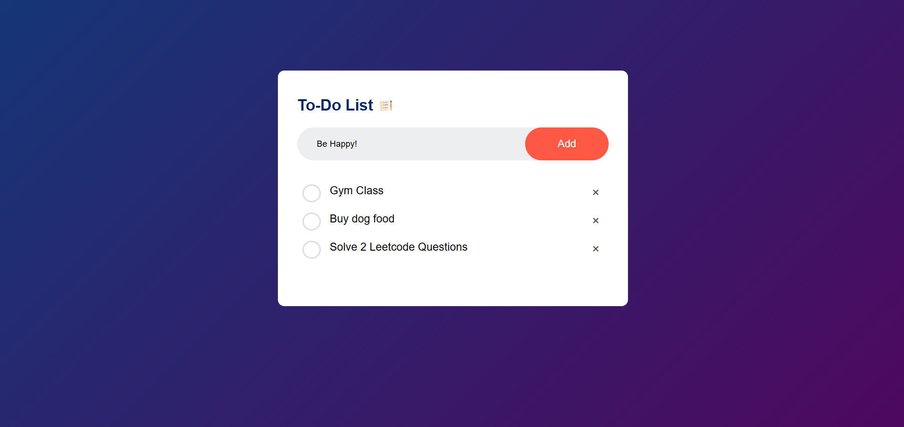

# To-Do List App

A simple and elegant To-Do List application built using HTML, CSS, and JavaScript. This app allows users to add, check, and delete tasks while keeping their tasks saved using the browser's local storage.

## Project Overview

The To-Do List App offers the following features:
- **Task Addition**: Allows users to add new tasks to the list.
- **Task Completion**: Users can mark tasks as completed by clicking on them.
- **Task Deletion**: Users can delete tasks individually.
- **Persistent Storage**: The app uses the browser’s local storage to save tasks, so they are available even after refreshing or closing the browser.

### Output



### Key Features

- **Modern and Minimal Design**: A visually appealing design with a neumorphic touch and a clean user interface.
- **Interactive Task Management**: Tasks can be easily added, checked as completed, or deleted.
- **Local Storage Integration**: Keeps tasks saved in the browser’s local storage for persistent access.

## Project Files

- **`index.html`**: Contains the HTML structure of the To-Do List App.
- **`style.css`**: Contains the CSS styles and layout for the application.
- **`script.js`**: Contains the JavaScript code for task management and local storage handling.
- **`images/`**: Contains icons used in the project, like unchecked and checked task icons.

## How to Use

**Clone the Repository**:
   ```bash
   git clone https://github.com/Krithika-N-4/To-Do-List.git
